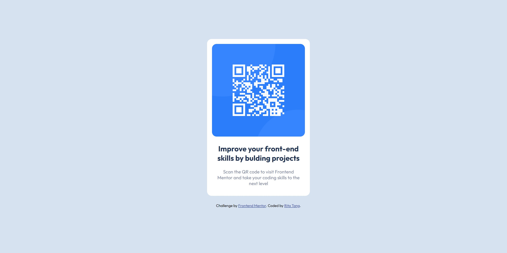

# Frontend Mentor - QR code component solution

This is a solution to the [QR code component challenge on Frontend Mentor](https://www.frontendmentor.io/challenges/qr-code-component-iux_sIO_H).

## Overview

The challenge is to build out the project and get it looking as close to the designs inside the `/design` folder as possible. Required assets are stored in the `/images` folder. There is also a `style-guide.md` file containing the information on the styles, such as color palette and fonts.

### Screenshot

### Links

- Solution URL: [solution URL](https://github.com/ritatanght/QR-code-component)

### Built with

- Semantic HTML5 markup
- CSS custom properties
- Flexbox
- CSS Grid